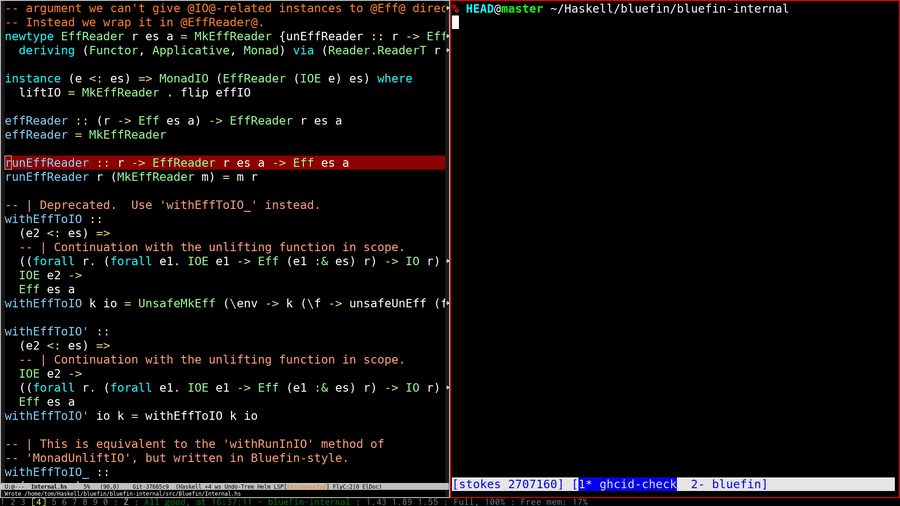

# `ghcid-check`

`ghcid-check` is tool for giving fast feedback to coding agents
writing Haskell. It is small wrapper around
[`ghcid`](https://github.com/ndmitchell/ghcid) for triggering a
reload, waiting for a response, and returning the corresponding exit
status.

## Why use `ghcid-check` rather than just `ghcid`?

`ghcid-check` is a lightweight wrapper around `ghcid`.  It makes it
convenient to carry out two operations:

1. Launch the `ghcid` process
2. Query the `ghcid` process for the type check status

You should use `ghcid-check` if you'd rather have a single easy-to-use
entry point to those two operations rather than learn how to do them
with `ghci` directly.

## Usage

### Start `ghcid`

First start a `ghcid` process by running `ghcid-check --launch` (for
example the directory containing your `.cabal` file):

```
ghcid-check --launch
```

If you have particular arguments you want to pass to `ghcid` you can
provide them:

```
ghcid-check --launch <ghcid args...>
```

### Trigger a `ghci` reload, print the output, receive exit status:

Run `ghcid-check --reload` to see the output from `ghcid` and receive
an exit status code indicating success or failure:

```sh
ghcid-check --reload
```

Exit status:

- `0` — no errors
- `1` — output contains an error
- `2` — unavailable output, timeout, or invalid usage

### `ghcid-check` in action



### Temporary files

`ghcid-check` uses two temporary files to communicate with `ghcid`:
`.ghcid-trigger` and `.ghcid-output`.  Once the underlying `ghcid`
process has terminated you can safely delete them.

## Agentic coding disclaimer

`ghcid-check` was written with significant use of agentic coding.
